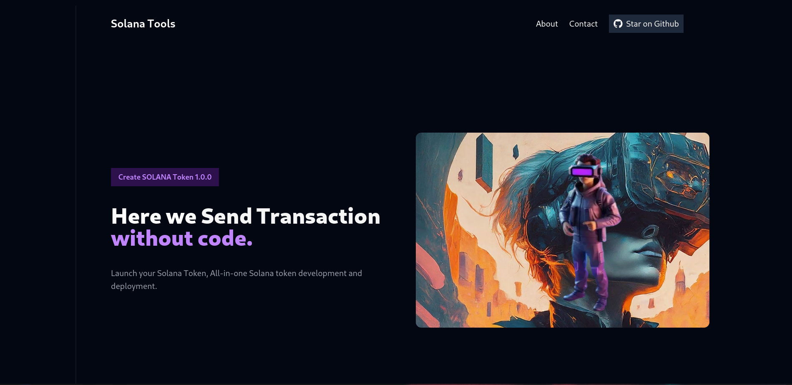

# Solana Tools

A powerful suite of tools for Solana blockchain development, built with **Next.js**, **Tailwind CSS**, and various **React libraries**. This app empowers users with an array of functionalities, including creating wallets, generating tokens, conducting airdrops, transferring tokens, and updating token metadata, all designed for ease of use and quick deployment.

 <!-- Replace this path with the actual path to your banner image -->


## Features

- **Create Wallet**: Effortlessly generate and manage crypto wallets across multiple blockchains.
- **Create Token**: Launch your own Solana token without any coding experience.
- **Get ATA Address**: Instantly retrieve your Associated Token Account (ATA) address.
- **Airdrop Token**: Distribute your Solana tokens to a large audience with a single click.
- **Transfer Token**: Securely transfer Solana tokens to others in seconds.
- **Update Token Metadata**: Keep your Solana token’s metadata accurate and up-to-date.
- **User-Friendly Interface**: Intuitive UI design built with Tailwind CSS for an enhanced user experience.

---

## Demo

Check out the live version: [Solana Tools Demo](https://solana-tools-xi.vercel.app/)

---

## Tech Stack

- **Next.js**: For building scalable, server-rendered React applications, offering optimized performance.
- **React**: JavaScript library for building user interfaces, with a component-based approach.
- **Tailwind CSS**: Utility-first CSS framework that allows quick, responsive, and custom UI styling.
- **Solana Web3.js**: Official Solana JavaScript library for blockchain and wallet interactions.
- **Radix UI**: Primitives for building accessible, high-quality, and customizable UI components.
- **React Toastify**: A notification library for displaying messages and alerts within the application.
- **Framer Motion**: Provides animations for an interactive and engaging user experience.
- **Three.js**: Used for adding advanced 3D rendering effects where necessary in the UI.
- **TypeScript**: Superset of JavaScript adding static typing, used here to enhance code quality and maintainability.


---

## Installation

1. **Clone the repository**:
   ```bash
   git clone https://github.com/your-username/solana-tools.git
   cd solana-tools
